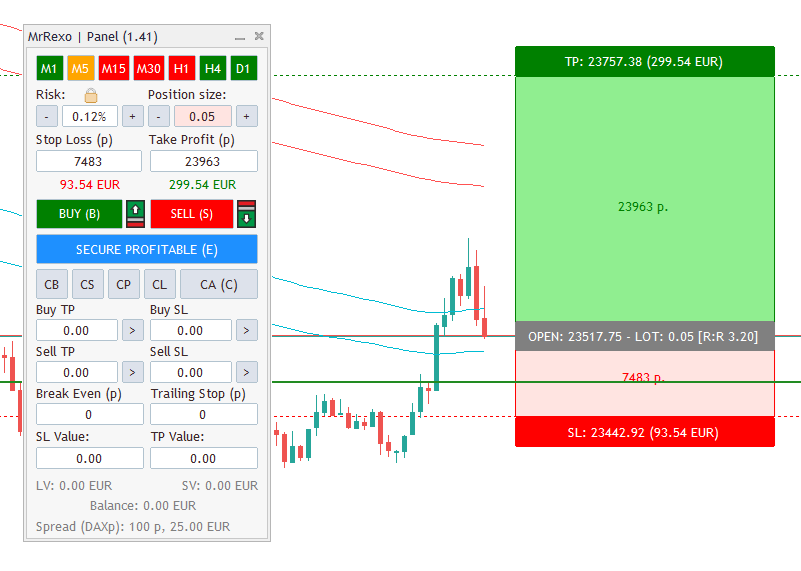

# 📊 MrRexoPanel – Panel Handlowy dla MetaTrader 5

## 🛠️ Instalacja

1. Skopiuj plik `MrRexoPanel.ex5` do folderu:
   ```
   MQL5/Experts
   ```
2. Skopiuj pliki graficzne (np. `lock.bmp`, `lock_open.bmp`, `calc_buy.bmp`, `calc_sell.bmp`) do folderu:
   ```
   MQL5/Images
   ```
3. Uruchom terminal MetaTrader 5.
4. Otwórz wykres wybranego instrumentu.
5. Przeciągnij panel MrRexoPanel z „Nawigatora” na wykres i zatwierdź.

---

## ⚙️ Główne funkcje panelu

### ✅ Zarządzanie pozycją
- Automatyczne obliczanie wielkości pozycji wg ryzyka (% salda).
- Graficzne przedstawienie poziomów SL (Stop Loss), TP (Take Profit) oraz OPEN (poziom wejścia).

### 📉 Trend na interwałach M1–D1
- 🟩 Zielony – trend wzrostowy  
- 🟥 Czerwony – trend spadkowy  
- ⬜ Szary – konsolidacja  
- 🟧 Pomarańczowy – brak jednoznacznego kierunku

### 📈 Linie Pivot
Obsługa modeli:
- Floor
- Woodie
- Camarilla
- Fibonacci

---

## ⌨️ Skróty klawiszowe

| Klawisz | Działanie                              |
|---------|----------------------------------------|
| B       | Kupno (Buy)                            |
| S       | Sprzedaż (Sell)                        |
| E       | Przeniesienie SL na Break Even         |
| C       | Zamknięcie wszystkich pozycji          |

---

## 🧩 Przyciski zamykania pozycji

| Przycisk | Opis                                          |
|----------|-----------------------------------------------|
| CB       | Zamknij wszystkie pozycje Buy                 |
| CS       | Zamknij wszystkie pozycje Sell                |
| CP       | Zamknij wszystkie zyskowne                    |
| CL       | Zamknij wszystkie stratne                     |
| CA       | Zamknij wszystkie pozycje (również klawisz C) |

---

## 📏 Zarządzanie SL / TP

- Buy/Sell TP/SL – ustawienie wspólnego TP/SL dla wszystkich pozycji danego typu.
- Przycisk [>] – zbiorcza modyfikacja SL/TP dla wybranego typu pozycji.

---

## ⚙️ Funkcje automatyczne

- **Break Even (p)**: SL do ceny wejścia po osiągnięciu określonej liczby punktów zysku.
- **Trailing Stop (p)**: automatyczne podążanie SL za ceną.

---

## 💰 Limity zysków i strat

- **SL Value**: zamyka wszystkie pozycje przy określonej stracie (suma).
- **TP Value**: zamyka wszystkie przy określonym zysku.

---

## 📊 Informacje bieżące

- **LV** – łączny zysk/strata pozycji LONG (zielony/czerwony/szary)
- **SV** – łączny zysk/strata pozycji SHORT
- **Balance** – bilans: suma LV + SV

---

## 🖱️ Zachowanie interfejsu

- Po starcie lub zmianie interwału panel R:R przypina się do ASK/BID w zależności od kierunku pozycji.
- Przesuwanie TP/SL myszką aktualizuje poziomy i przelicza wartości.
- Przesunięcie OPEN przesuwa całość z zachowaniem TP/SL.
- Podwójne kliknięcie ikony strzałki – zwinięcie panelu R:R.
- Przeciągnięcie R:R powyżej/pod ASK/BID zmienia etykiety BUY/SELL.

---

## 🔒 Blokada ryzyka

- **Zablokowana kłódka** – stały procent ryzyka, automatyczne dostosowanie wielkości pozycji przy zmianie SL.
- **Odblokowana kłódka** – ręczne ustawienie wielkości pozycji niezależnie od SL.

---

> 📧 Kontakt: mrrexo.mt5@gmail.com
